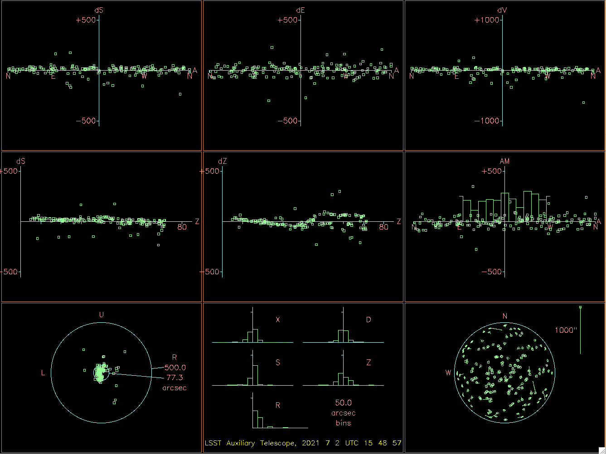

..
  Technote content.

  See https://developer.lsst.io/restructuredtext/style.html
  for a guide to reStructuredText writing.

  Do not put the title, authors or other metadata in this document;
  those are automatically added.

  Use the following syntax for sections:

  Sections
  ========

  and

  Subsections
  -----------

  and

  Subsubsections
  ^^^^^^^^^^^^^^

  To add images, add the image file (png, svg or jpeg preferred) to the
  _static/ directory. The reST syntax for adding the image is

  .. figure:: /_static/filename.ext
     :name: fig-label

     Caption text.

   Run: ``make html`` and ``open _build/html/index.html`` to preview your work.
   See the README at https://github.com/lsst-sqre/lsst-technote-bootstrap or
   this repo's README for more info.

   Feel free to delete this instructional comment.

:tocdepth: 1

.. Please do not modify tocdepth; will be fixed when a new Sphinx theme is shipped.

.. sectnum::

.. TODO: Delete the note below before merging new content to the master branch.

.. note::

   **This technote is not yet published.**

   AuxTel pointing determination and CWFS measurements show non-repeatability and high-order dependencies.
   This technote describes the actions taken to diagnose the issue.

Observed Behavior
=================

.. _pointing_technote: https://tstn-014.lsst.io/v/DM-30308/runs/run-202106.html

- Struggled to obtain reliable and repeatable pointing of the Auxiliary Telescope

- Believed early-on that it was mostly due to inaccuracies in measurements and due to the M1 and M2 LUTs not be sufficiently stable due to a poor sampling of the observing range and/or poor fits to that data

- Significant time has been spent to accumulate more data for the pointing model, details are found in the pointing_technote_.
  The main conclusions are two fold.

    #. There is a high-order "wiggle" around 30-40 degrees in elevation that is not well fit.
       This can be seen in the central plot of the following figure.
       It is also present in the center-left plot but is less obvious.
       The pointing component is better suited to smooth behaviors, so which this is not.

    #. There is significant scatter in the pointing observations, even for the same telescope position.
       Values can be up to 30 arcsec. This indicates a non-repeatable component in one of the mirror positions.

    The "9 favorite plots for altazimuth".
    This plot gathers the 9 most relevant plots with information about the pointing model fit for an altaz mount.
    **Top-left-hand:** The east-west residuals plotted against hour angle.
    **Top-center:** The declination residuals plotted against declination.
    **Top-right-hand:** Zenith-distance errors against zenith distance.
    **Center-left-hand:** The east-west residuals plotted against zenith distance.
    **Center:** The declination residuals plotted against hour angle.
    **Center-right-hand:** The residuals are interpreted as changes in the h/δ non-perpendicularity and plotted against hour angle.

- Significant time has also been spent accumulating data to create an M2 position look-up table.
  This is completed by performing CWFS measurements at multiple elevations.
  Again, there is scatter in the data that corresponds to about 0.2 mm of hexapod motion, which is equivalent to ~30 nm of WFE.

.. figure:: /_static/hexapod_combined.jpg
    :name: fig-hexapod_combined
    :target: ../_static/hexapod_combined.jpg
    :alt: hexapod_original_data

    The accumulation of multiple datasets where we measured the hexapod position as a function of elevation.

- Until recently, there has been no other external measurement to help constrain the problem.

- We currently have no temperature sensors, however, there have been nights where the temperature remains stable and these effects are still seen.
  For the data discussed below the temperature increased ~8 degrees C but then held stable for ~6 hours which is when we took the data.

- Hexapod corrections only include translation and piston (focus).
  No tilt correction is currently applied, up to now, it has been assumed that this is best is taken out by the pointing model.
  The tilt is currently set to what was measured by Roberto during optical alignment

Information from the Optical Model
==================================

- During the last run a dataset was taken both translating and tip/tilting the hexapod.

- For each datapoint, the hexapod was moved by a set amount, and CWFS datasets were taken to measure the induced aberration(s).

- These were then compared against the optical model.
  For this analysis, the most important information is as follows:

    #. For M1, a 1mm lateral shift of the mirror results in ~65 arcseconds of image motion.
       Confirming this experimentally is really hard as we must adjust the belly-band manually and therefore we have not done it.

    #. For M2, a 1mm displacement results in 54.7 arcsec of image motion.
       Experimentally we measure ~52.5 and ~50.5 in X and Y.

    #. For M2, 0.0022 degrees (8 arcsec) of tilt results in 30 arcsec of image motion
       For the 266mm diameter mirror this corresponds to 0.33 mm of (roughly) vertical motion.
       This has not been verified experimentally, although the data exists to do so.

- We have experimentally measured the WFE induced by tipping/tilting M2, and by translating.
  The following figure shows the effects of translation of the hexapod X-axis, which is aligned with the gravity vector

.. figure:: /_static/hexXoffset_sensitivity.jpg
    :name: fig-hexapod_X_sensitivity
    :target: ../_static/hexXoffset_sensitivity.jpg
    :alt: fig-hexapod_X_sensitivity

    The WFE induced by translating the AT M2 hexapod in the X-axis.
    The Y-axis is the same in magnitude but the axes of the aberrations are flipped.
    Note that previous datasets have yielded ~30% higher slopes, so note that there may be uncertainty here.

- The next figure shows the effect of tipping (rotation in U, which is about the Y-axis).
  Rotation about the X-axis is the same magnitude but the aberrations are seen in the other axis (e.g. Coma-X instead of Coma-Y)

.. figure:: /_static/hexUoffset_sensitivity.jpg
    :name: fig-hexapod_U_sensitivity
    :target: ../_static/hexUoffset_sensitivity.jpg
    :alt: fig-hexapod_U_sensitivity

    The WFE induced by tipping the AT M2 hexapod in the U-axis.
    The V-axis is the same in magnitude but the axes of the aberrations are flipped.

Efforts to Isolate the Issue(s)
===============================

- Decided to spend time investigating both image motion and hexapod repeatability using a single concentrated dataset

- For this run, we have installed 3 micrometers on the M1 mirror to measure translation in all three axes.

.. figure:: /_static/mitutoyo_placements.png
    :name: fig-mitutoyo_placements
    :target: ../_static/mitutoyo_placements.png
    :alt: fig-mitutoyo_placements

    Mitutoyo dial indicators have been positioned to in these locations to measure primary mirror motion as a function of elevation.

- A dedicated dataset was taken moving up and down in elevation continually taking CWFS datasets to look at hexapod motion
  An in-focus image was also taken to observe the repeatability in the pointing

- Based on impromptu testing and some back of the envelope calculations, it was hypothesized that the top end was possibly loose.
  We currently lack instrumentation to diagnose this effectively, but people are trying to secure cell phones to the spiders and tap them to measure the fundamental frequency, essentially to determine if any are loose. This is on-going.

- Initial tests have shown excessive vibration in the spider vane (turnbuckle) in the following image.
  When tapped, this strut would vibrate for 1-2s, whereas the others had no discernible vibration

.. figure:: /_static/Struts.jpg
    :name: fig-Struts
    :target: ../_static/Struts.jpg
    :alt: fig-Struts

    The indicated vane appears to show increased vibration relative to the others.

Mirror Motion from dataset on the night of July 6, 2021
=======================================================

- The following data have been collected by moving up and down in elevation and performing CWFS measurements and subsequently applying the corrections to minimize WFE.
  This basically collimates and focuses the telescope at each position.

- The following plot shows the M1 mirror and M2 hexapod position as a function of elevation after a few dips

.. figure:: /_static/mirror_motion_on_axes_parallel_to_gravity.jpg
    :name: fig-mirror_motion_on_axes_parallel_to_gravity
    :target: ../_static/mirror_motion_on_axes_parallel_to_gravity.jpg
    :alt: fig-mirror_motion_on_axes_parallel_to_gravity

    Mirror motion along the elevation axis.
    The M1 motions (left) show a smooth hysteresis curve with a separation of ~0.05 mm.
    The M2 motions show a ~0.2mm RMS scatter, primarily at high altitude.
    The M2 motion is also not a low-order smoothly varying function.

- The following plot shows the M1 mirror and M2 hexapod position as a function of elevation for the same dataset, but now showing the axis perpendicular to elevation (and not aligned with gravity).

.. figure:: /_static/mirror_motion_on_axes_perpendicular_to_gravity.jpg
    :name: fig-mirror_motion_on_axes_perpendicular_to_gravity
    :target: ../_static/mirror_motion_on_axes_perpendicular_to_gravity.jpg
    :alt: fig-mirror_motion_on_axes_perpendicular_to_gravity

    Mirror motion perpendicular to the elevation axis (and gravity vector)
    The M1 motions (left) show a smooth but reduced hysteresis curve with a separation of ~0.03 mm.
    The M2 motions show a ~0.2mm RMS scatter; the elevation dependence is less clear.
    Again, the M2 motion is also not a smoothly varying function.

Motion Summary
==============

Based on the observed motions we can use the sensitiviy matrices to calculate their contributions

- M1 motion of 0.05 mm is the same as displacing M2, therefore assuming a worst case scenario this would result in 139*0.05 = 7 nm of WFE without correction and ~2.6 arcsec of image motion.
  In reality because this is a smooth function it is probably lower than this.
  **M1 cannot be the source of the large non-repeatability**

- M2 "random" motion in each axis of 0.2 mm RMS results in a WFE of ~28 nm.
  This also results in ~10 arcsec of pointing error per axis
  The PSF motion (pointing error) from this dataset has not yet been completed, however, based on the pointing model deviations of ~30 arcsec, it is anticipated that a tip/tilt motion is also required to account for this.

- If we assume 20 arcsec of pointing error comes from tip/tilt, this would result in only 0.9 nm of WFE, which we'd never be able to measure

- Based on the vibration data, a loose top-end seems consistent.

- The spec for the telescope pointing requirement is 10 arcsec over the entire sky.
  The non-repeatability needs to be addressed to meet this requirement.
  M1 motion will eventually limit pointing accuracy but is not currently a significant contribution to the error budget.

Questions
=========

#. The top end has 8 turn-buckles and is therefore very over-constrained. What is the expected behavior of the mirror motion with elevation?

#. Does motion at high elevation make sense?

#. How should the spiders be torqued?

#. Adjusting the top end has some pretty severe down-stream impacts on pointing, ATAOS LUTs etc. Are we sufficiently certain that

.. Add content here.
    The optical model says that for a 1 mm shift of the mirror, all in one axis, there is ~65 arcsec of image motion. Note that we measure ~0.14 mm of mirror motion... i think.
    For M2, if we displace it by 1mm, the model says we should get 54.7 arcsec of image motion, We measured ~52.5 and ~50.5 arcsec per mm on sky. I'm not sure why there is a discrepancy... (edited)

    Patrick Ingraham  8:33 PM
    So essentially any error we see from the primary mirror motion is below 10 arcseconds, and that would be complete uncorrected. We're obviously doing some amount of correction so i'm sure it's a small fraction of that.

    Patrick Ingraham  8:47 PM
    to get 30 arcsec of image motion, this requires a tilt of ~0.0022 degrees (8 arcsec) on M2. For a 266mm diameter mirror that's 0.33mm of motion at the edge.
    8:49
    my bet is that the top end is loose and we're seeing hysteresis
.. Make in-text citations with: :cite:`bibkey`.

.. .. bibliography:: local.bib lsstbib/books.bib lsstbib/lsst.bib lsstbib/lsst-dm.bib lsstbib/refs.bib lsstbib/refs_ads.bib
..    :style: lsst_aa
